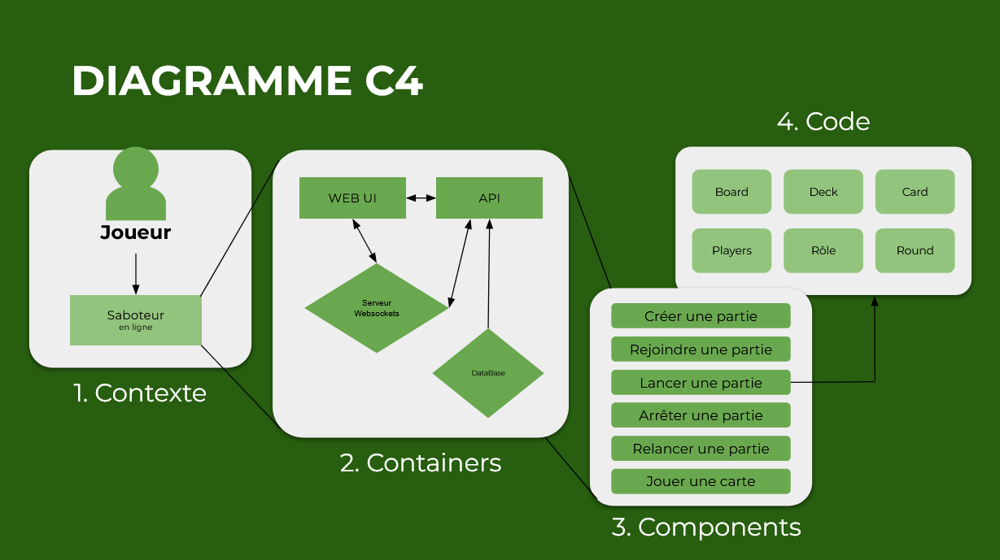

# 🃏 Le Saboteur

Un jeu multijoueur en ligne basé sur le jeu de société "Saboteur", conçu pour des groupes d’amis à distance. Deux équipes s’affrontent : les **Nains** cherchent la pépite, tandis que les **Saboteurs** tentent de les en empêcher.

---

## 🧭 Sommaire

1. [Diagramme C4](#-diagramme-c4)
2. [Design Patterns utilisés](#-design-patterns-utilisés)
3. [Architecture technique](#-architecture-technique)
4. [Fonctionnalités du jeu](#-fonctionnalités-du-jeu)
5. [Utilisation du jeu](#-utilisation-du-jeu)
6. [Plan de tests](#-plan-de-tests)
7. [Axes d'améliorations](#-axes-daméliorations)

---

## 🗺️ Diagramme C4




---

## 🧩 Design Patterns utilisés

### **Singleton**
Le Singleton garantit qu'une classe n'a qu'une seule instance et fournit un point d'accès global à cette instance. Dans notre projet, il est utilisé pour des éléments centralisés comme la traduction ou notre service redis.

### **Adapter**
Le pattern Adapter permet de faire coopérer deux interfaces incompatibles en les convertissant en une interface commune. On utilise notamment des DTO pour transformer nos entités.

### **Decorator**
Le pattern decorator est utilisé pour ajouter dynamiquement des comportements aux cartes ou actions sans modifier leur structure d’origine. On les utilise notamment dans notre projet pour vérifier si une entité existe bel et bien avant de faire une requête.

### **Observer**
Le pattern observer a été mis en place pour notifier les joueurs des changements en temps réel via WebSocket.

### **Proxy**
Le pattern Proxy permet de contrôler l'accès aux cas d'utilisation, de cacher la complexité et d'ajouter des fonctionnalités supplémentaires sans modifier les classes de cas d'utilisation.

---

## 🛠️ Architecture technique

Le projet est structuré en monorepo avec les dossiers principaux suivants :

- **`apps/`** : Contient les applications principales
  - **`frontend/`** : Application React pour l'interface utilisateur
  - **`api/`** : Serveur NestJS gérant la logique métier et les WebSockets
- **`packages/`** : Contient les packages réutilisables
  - **`eslint/`** : Configuration ESLint partagée

### Stack technologique

- **Frontend** : React + TypeScript
- **Backend** : NestJS (Node.js) avec WebSocket
- **Base de données** : PostgreSQL, Redis
- **Gestion des dépendances** : Yarn
- **Conteneurisation** : Docker avec `docker-compose`

---

## 🎮 Fonctionnalités du jeu

- Création, lancement et gestion de parties
- Attribution aléatoire des rôles : Nain ou Saboteur
- Pose de cartes pour construire des chemins ou saboter les autres joueurs
- Rotation des cartes 
- Résolution du chemin gagnant
- Objectifs :
  - **Nains** : Atteindre la pépite d'or
  - **Saboteurs** : Empêcher les Nains d'atteindre la pépite
- Rotation des tours entre les joueurs
- Notifications en temps réel via WebSockets
- Fin de partie automatique avec annonce des vainqueurs

---

## 🧪 Utilisation du jeu

### Prérequis

- **Node.js** 
- **Yarn**
- **Docker** et **Docker Compose** (pour la base de données PostgreSQL)

### Installation

1. **Cloner le dépôt :**

   ```bash
   git clone https://github.com/Maximauve/Saboteur.git
   ```

2. **Installer les dépendances :**

   ```bash
   cd Saboteur
   yarn install
   ```

3. **Configurer les variables d'environnement :**

   Copier le fichier `.env.example` en `.env` et renseigner les variables nécessaires.

   ```
    NEST_PORT=3000

    REDIS_HOST=localhost
    REDIS_PORT=6379
    REDIS_USER=
    REDIS_PASSWORD=
    REDISCLOUD_URL=redis://localhost:6379

    DB_SSL=false
    DB_HOST=localhost
    DB_PORT=5432
    DB_USER=saboteur_user
    DB_PASSWORD=saboteur_password
    DB_DATABASE=saboteur_db

    AWS_ACCESS_KEY_ID=minioadmin
    AWS_SECRET_ACCESS_KEY=minioadmin
    AWS_BUCKET=data
    AWS_ENDPOINT=http://localhost:9000/
    MINIO_ADDRESS=9000
    MINIO_CONSOLE_ADDRESS=9001

    JWT_SECRET=secret-My-Secret

    FRONT_BASE_URL=http://localhost:8080

    VITE_API_BASE_URL=http://localhost:3000/
   ```

4. **Démarrer la base de données avec Docker :**

   ```bash
   docker-compose up -d
   ```

5. **Lancer le backend (API) :**

   ```bash
   yarn dev:api
   ```

6. **Lancer le frontend :**

   ```bash
   yarn dev:frontend
   ```

### Accès à l'application

- **Frontend** : [http://localhost:8080/](http://localhost:8080/)
- **Swagger API** : [http://localhost:3000/swagger](http://localhost:3000/swagger)


### Notice d'utilisation (règles)

  Deux équipes secrètes s’affrontent : Nains (chercheurs d’or) vs Saboteurs.

  Les Nains doivent construire un chemin jusqu’à la pépite d’or cachée.

  Les Saboteurs tentent de les bloquer sans se faire repérer.

  À chaque tour, un joueur peut poser une carte, utiliser une action (sabotage, réparation…) ou défausser.

  Un joueur ne peut pas creuser s’il est saboté.

  La partie se termine lorsque :

  - Un chemin atteint la pépite → Victoire des Nains

  - La pioche est vide et aucun chemin n’atteint la pépite → Victoire des Saboteurs

Pour plus d'informations sur les règles : 

https://www.letempledujeu.fr/IMG/pdf/saboteur.pdf

---

## ✅ Plan de tests

- **Couverture de tests** : Objectif de 70%
- **Tests unitaires** : Vérification des cas d'utilisation et de la logique métier
- **Tests d'intégration** : Vérification des interactions entre les différents modules et services
- **Tests de composants** : Tests des composants React pour l'interface utilisateur

---

## 🚀 Axes d'améliorations

- Rendre l’interface utilisateur **responsive** pour une meilleure expérience sur mobile et tablette
- Mettre en place un processus de **déploiement continu (CI/CD)** pour automatiser les déploiements
- Déployer le projet sur une plateforme en ligne pour le rendre accessible au public
- Ajouter des fonctionnalités supplémentaires, telles que :
  - **Reconnexion automatique** en cas de déconnexion accidentelle
  - **Historique des parties** pour permettre aux joueurs de revoir leurs parties précédentes

---

## 👨‍💻 Auteurs

- **Maxime MOURGUES**
- **Mattéo FERREIRA SILVA**
- **Sandra HERAUD**

---

## 📄 Licence

Ce projet est sous licence [MIT](LICENSE).
